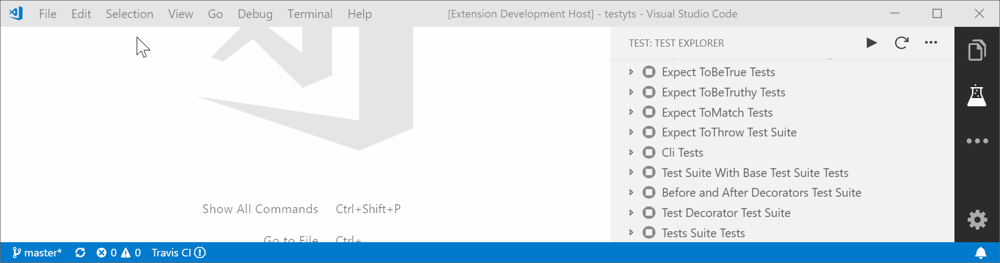

# TestyTs Test Explorer for Visual Studio Code

Run your [TestyTs](https://www.npmjs.com/package/testyts) tests using the 
[Test Explorer UI](https://marketplace.visualstudio.com/items?itemName=hbenl.vscode-test-explorer).

## Features

* Shows a Test Explorer in the Test view in VS Code's sidebar with all detected tests and suites and their state

## Getting started

* Install the extension and restart VS Code
* Open the Test view
* Run / Debug your tests using the  /  icons in the Test Explorer or the CodeLenses in your test file

## Configuration

Property                        | Description
--------------------------------|---------------------------------------------------------------
`testyTsExplorer.debuggerPort`        | The port to use for debugging sessions (default: `9229`)
`testyTsExplorer.nodePath`         | The path to the node executable to use. By default, it will attempt to find it on your PATH.

## Commands

The following commands are available in VS Code's command palette, use the ID to add them to your keyboard shortcuts:

ID                                 | Command
-----------------------------------|--------------------------------------------
`test-explorer.reload`             | Reload tests
`test-explorer.run-all`            | Run all tests
`test-explorer.cancel`             | Cancel running tests

## Roadmap

- Custom debugger configuration
- Custom testyts config file
- Logging
- Show a failed test's log when the test is selected in the explorer
- Adds CodeLenses to your test files for starting and debugging tests

## Contributing
Pull requests are welcome. For major changes, please open an issue first to discuss what you would like to change.

Please make sure to update tests as appropriate.

If you think you've found a bug, please [file a bug report](https://github.com/Testy/vscode-testyts-test-adapter/issues) and attach the diagnostic logs.

## License
[MIT](./LICENSE)